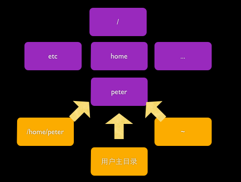

#2016年11月7号上午

---

###为什么要用 Linux ?

北京的（包扩硅谷）的职业开发者一般都用苹果本（ Macbook ）做开发（写代码）。我们是做 Web 开发的，Web 项目要运行在服务器（ server ）上，服务器的业界标准是使用 Linux 做操作系统呢。

幸运的是， MacOS 和 Linux 都是 Unix 的变种，使用起来大同小异。所以我们课程中使用 Linux 做开发也是非常棒一个选择。Peter 本人用 Linux 做开发，用了5年。

###打开命令行界面

Ctrl-Alt-T 是深度 Linux 系统上打开命令行窗口的快捷键。命令行窗口中可以运行的程序不唯一。默认启动的程序叫做 Bash ，这个是我们这个要学习的核心。在 Bash 下就可以来输入各种 Linux 命令了。

但是，命令行窗口中也能启动其他的程序，例如 Python/Javascript 的解析器。

###命令行能干什么？

命令行和鼠标（图形化的界面）一样是人类操作电脑的一种方式。基本上鼠标能干得活，命令行都能干（个别的像 Photoshop 的一些操作不太好弄）。

同时，只要命令行能干的事情，都会比鼠标更高效，因为命令行是可以批处理的。实际开发中，我们用命令行最经常的操作就是，创建文件，删除移动文件等。

举个例子，如果我要在桌面上创建一个文件夹，可以用鼠标右键来创建，同时如果用命令行，操作如下

```
cd Desktop
mkdir FolderName
```

最终操作结果是等价的。但是如果要学习命令行操作，第一步就是要掌握文件系统结构。

###插播一个 Linux 八卦

Linux 系统运行在所有的 Andriod 手机上，全球最强的十台 super computer 其中有九台（或者十台）运行 Linux 。80% 的服务器都用 Linux 。

所以说 Linux 很牛，但是它的价格是：0元。它的价值是多少？大约200亿美元。到底是谁做成了200亿的东西，却 give it for free 。这个人就是 Linus 。

Linus 是芬兰人，他父亲是政治家（共产主义者）。Linus 在大二的时候创作 Linux 操作系统。69年出生，今天依然在写代码。

继续来聊文件系统（ File System ）

如果我们想对文件进行，增删改查（ touch rm mv vim ），或者说进行文件的创建，删除，移动，重命名等操作，首先要解决是什么呢？要能找到它。或者说，就是要知道文件在文件系统上的位置。

所以，我们首先要聊的是文件系统的结构。实际上就是说一下，Linux 系统默认的那些文件夹的结构。实际上这个结构是非常简单的。

Windows 系统上还分 C/D 盘，Linux 这里其实更简单。所有的文件夹都会存在一个顶级老祖宗文件夹之内。这个老祖宗的名字叫做 / 。



图片中，位置非常独特的文件夹还有一个，就是 /home/peter ，它通常被称为用户主目录 ，它还有个外号叫 ~ 。用户默认登陆进系统之后，默认的着陆位置就是这个文件夹。同时，默认用户只是在这个文件夹里有写权限，而在这个之外的地方是没有写权限的。

要真正找到文件，需要我们学会如何在文件系统内做跳转 。

如何在文件系统内做跳转？

这里我们会使用到的一个核心命令叫 cd （ Change Directory 改变文件夹 ) 。所以说文件系统内做跳转，其实就是改变当前文件夹。

查看当然文件夹中的内容，就用

```
ls
```

这个命令。我们可以看到的输出结果大概是

```
$ ls
Desktop Application Download
```

那么，现在如果我们想要跳转到桌面（或者说就是把当然文件夹改变为桌面），那就来执行
```
cd Desktop
```

这样就可以跳转到桌面了。到桌面执行 mkdir FolderName 来看看这个新的文件夹，是否真正创建到了桌面上（ mkdir 全称就是 make Directory ，创建一个文件夹）。

如何跳转到上一级文件夹

```
cd ..
```

其中 .. 就是上一级文件夹的外号。

如何快速的回到用户主目录呢?

```
cd ~
```

或者

```
cd  
```

都可以。

知道了，如何在文件系统中跳转了，我们就可以进一步学习各种文件操作了（创建，移动，重命名，删除等等）。

创建文件或者文件夹

创建文件夹

```
mkdir project
```

注意：创建的位置要在用户主目录内部，不然会遇到权限不够的问题。

进入这个项目文件夹

```
cd project
```

这样，当前文件夹 就切换到了 project 之内。

插播一个小技巧：可以用 pwd （ Print Working Directory 打印当前文件夹）来显示精确的位置。

创建一个文件，可以用

```
touch fileName
```

注意：Windows 系统上，一般文件都是要有后缀，但是 Linux 下没有这个要求。

但是，一般我们都是用 atom 编辑器来创建文件。

```
atom .
```

注：. 代表当前位置（当前文件夹）。

删除文件或者文件夹

删除一个文件

```
rm fileName
```

删除一个文件夹

```
rm -r folderName
```

移动

移动用到的是 `mv` 命令

`mv` 被移动的文件或者文件夹的路径  目标文件夹位置
重命名

`mv` 被移动的文件或者文件夹的路径  不存在的位置/文件名
这样进行的就是原来文件的重命名操作。

复制粘贴

用 `cp` 这个命令。

`cp` 被拷贝的的文件  目标位置
拷贝文件夹git@github.com:happypeter/digicity.git

`cp -r` 被拷贝的的文件夹 目标位置
